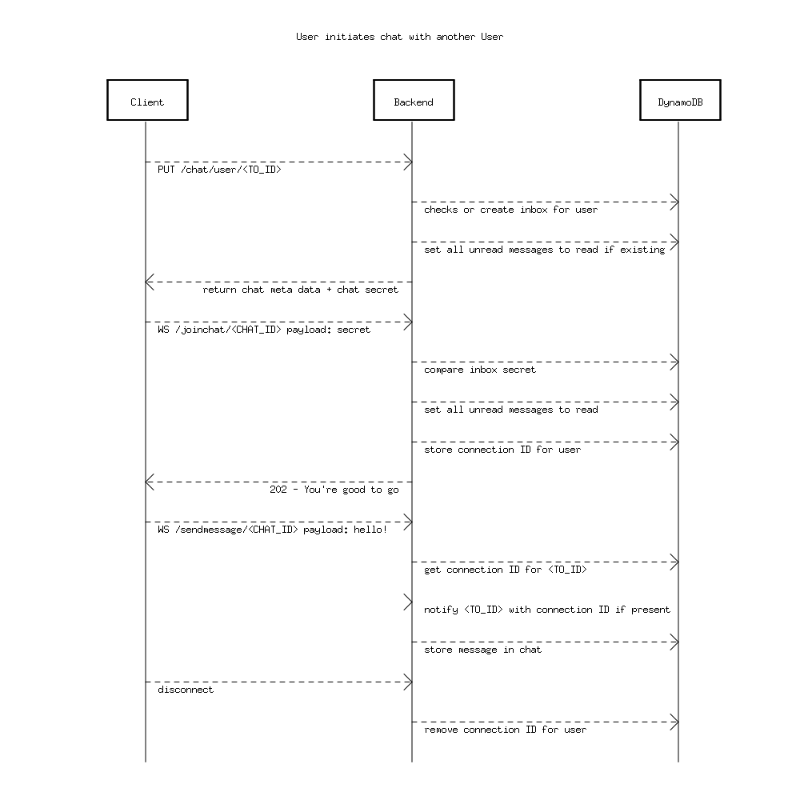
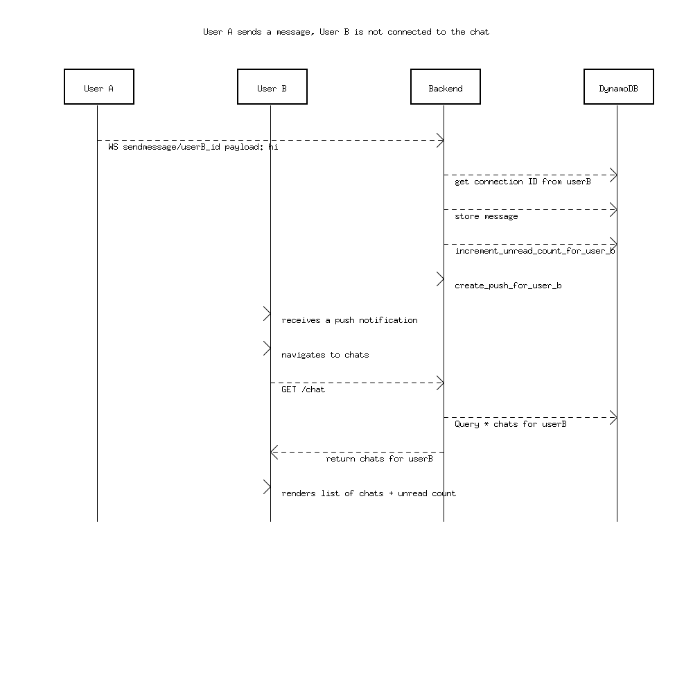
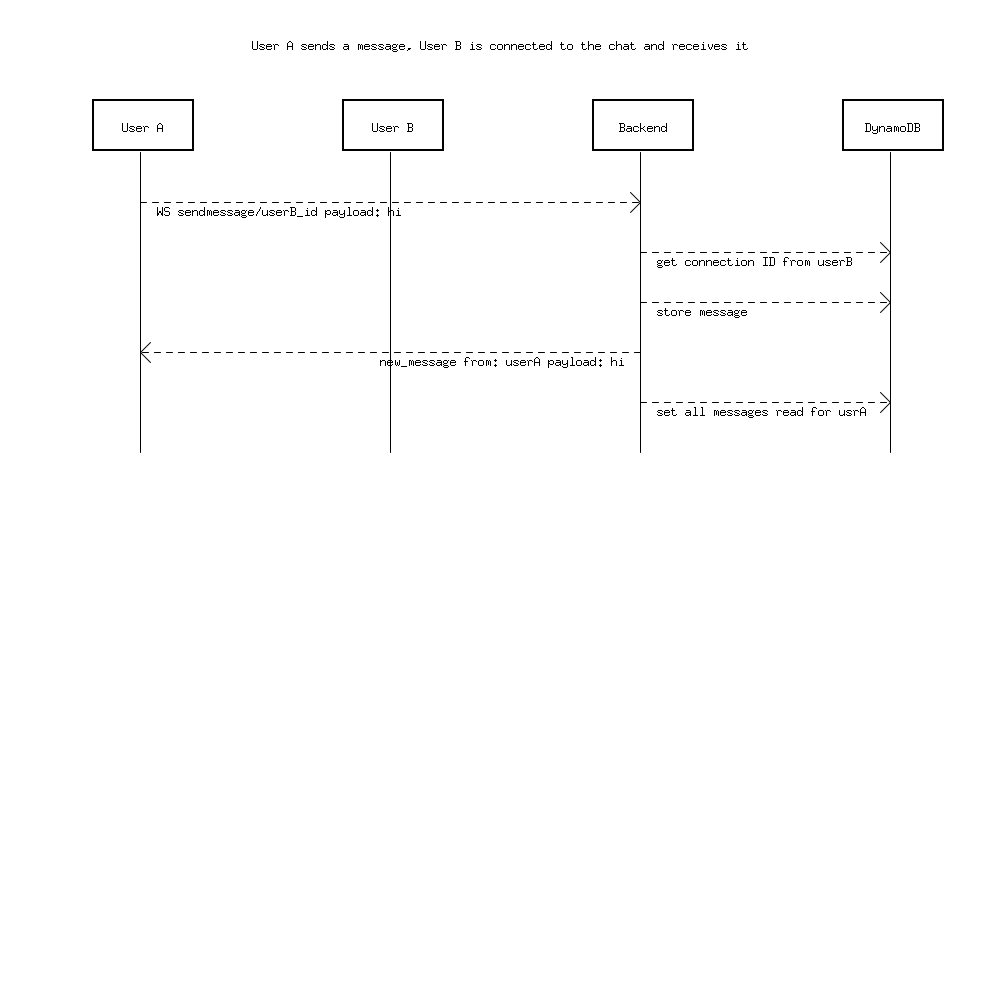

# go-uml

[![CI][badge-build]][build]
[![GoDoc][go-docs-badge]][go-docs]
[![GoReportCard][go-report-card-badge]][go-report-card]
[![License][badge-license]][license]

Just a little tool to create UML Diagrams built in Go. You can use it already to build simple sequence diagrams, however, this project is still under development
and you won't find some functionalities yet such as

- provide conditional flows

The generated diagram is saved as .PNG file

So far, you can create only sequence diagrams and add Participants, directional and non-directional Edges, labels for Edges and set a Title for the diagram.
I'll be updating this repository whenever I need the tool to support more functionality, feel free to create an Issue with a feature request. Since I just started this project, contributing should also be quite easy (I appreciate any contribution).

You don't need to download any dependencies such as plantUML or Graphviz, which is what most of the tools out there require and what was also my motivation to start this project. go-uml is using a [2D graphics engine](https://github.com/fogleman/gg) written 100% in Go 

# How to install

Simply run
```
go get -u github.com/mriceman/go-uml
```

Make sure you are executing this in a go project, other wise you have to run

```go mod init <project-name>```

first

# Example

```go
 	d := sequence.NewDiagram("user_starts_chatting")

	client := "Client"
	backend := "Backend"
	db := "DynamoDB"

	d.SetTitle("User initiates chat with another User")
	
	d.AddParticipants(client, backend, db)

	d.AddDirectionalEdge(client, backend, "PUT /chat/user/<TO_ID>")
	d.AddDirectionalEdge(backend, db, "checks or create inbox for user")
	d.AddDirectionalEdge(backend, client, "return chat meta data + chat secret")
	d.AddDirectionalEdge(client, backend, "WS /joinchat/<CHAT_ID> payload: secret")
	d.AddDirectionalEdge(backend, db, "compare inbox secret")
	d.AddDirectionalEdge(backend, db, "set all unread messages to read")
	d.AddDirectionalEdge(backend, db, "store connection ID for user")
	d.AddDirectionalEdge(backend, client, "202 - You're good to go")
	d.AddDirectionalEdge(client, backend, "WS /sendmessage/<CHAT_ID> payload: hello!")
	d.AddDirectionalEdge(backend, db, "get connection ID for <TO_ID>")
	d.AddDirectionalEdge(backend, backend, "notify <TO_ID> with connection ID if present")
	d.AddDirectionalEdge(backend, db, "store message in chat")
	d.AddDirectionalEdge(client, backend, "disconnect")
	d.AddDirectionalEdge(backend, db, "remove connection ID for user")

	d.Render()

```
Resulting PNG file: 


Some more examples:



## Warning - AI not welcome here
Because of my own personal philosophy regarding technology and AI, all the code in this repository that was written by me - I wrote 100% on my own. There is and will be no usage of Github Co-Pilot or any other AI tool. I became a software developer because of my passion for our craft - Software Engineering. I build this tool because I enjoy programming. Every single line of code you'll read in this repo, that was written by me, is produced first in my mind and then manifested into reality through my hands. I encourage any contributor to follow the same principle, though I can't and don't want to put any restrictions on this.
Just like people stopped walking because they commute by cars and trains, which caused an increase in obesity and illness, I believe that the massive usage of AI will cause people to stop thinking and using their minds and the resulting havoc is unthinkable.

[license]: ./LICENSE
[badge-license]: https://img.shields.io/github/license/MrIceman/go-uml.svg
[go-docs-badge]: https://godoc.org/github.com/MrIceman/go-uml?status.svg
[go-docs]: https://godoc.org/github.com/MrIceman/go-uml
[go-report-card-badge]: https://goreportcard.com/badge/github.com/MrIceman/go-uml
[go-report-card]: https://goreportcard.com/report/github.com/MrIceman/go-uml
[badge-build]: https://github.com/MrIceman/go-uml/actions/workflows/go.yml/badge.svg
[build]: https://github.com/MrIceman/go-uml/actions/workflows/go.yml
